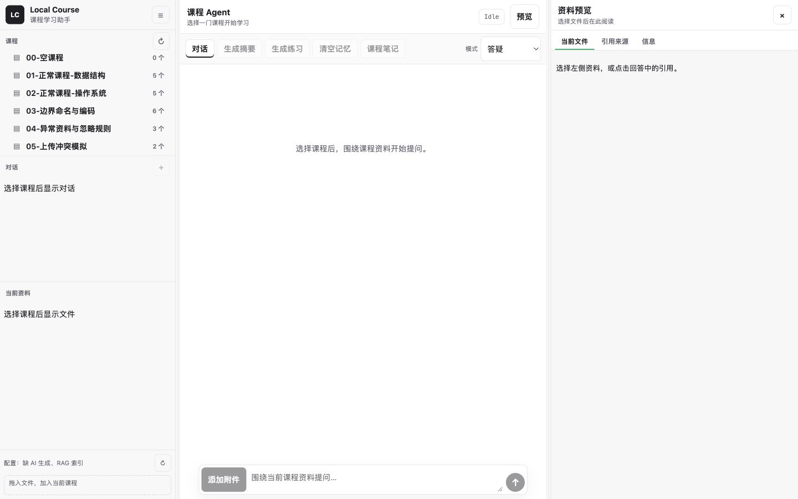
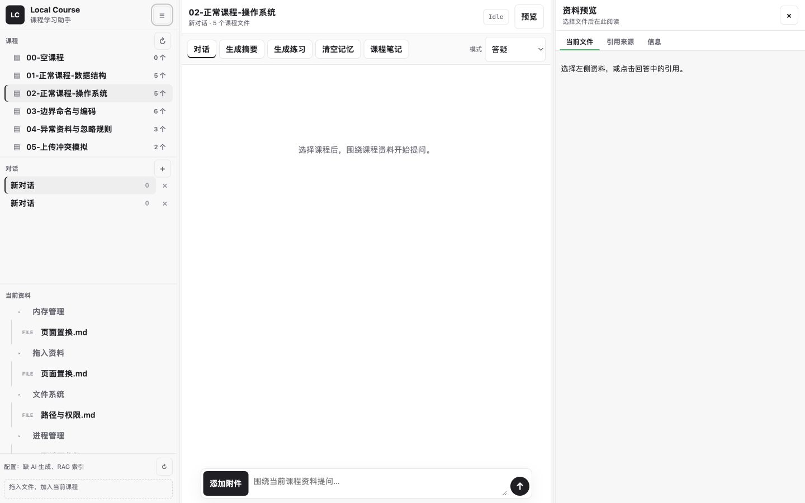
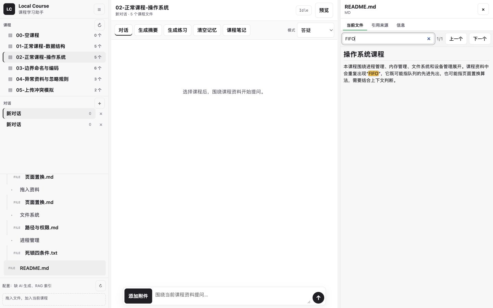
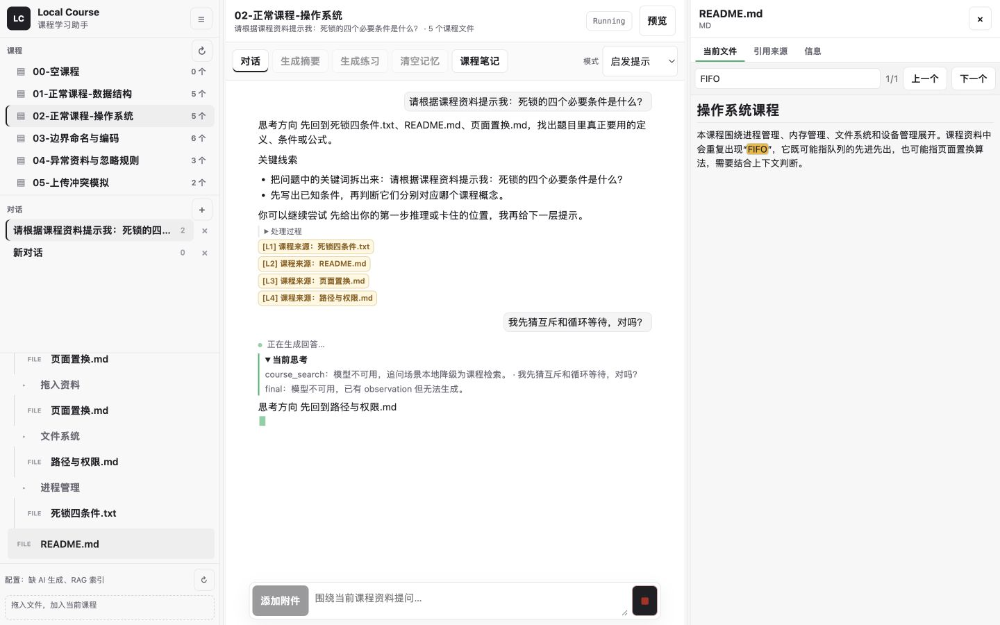
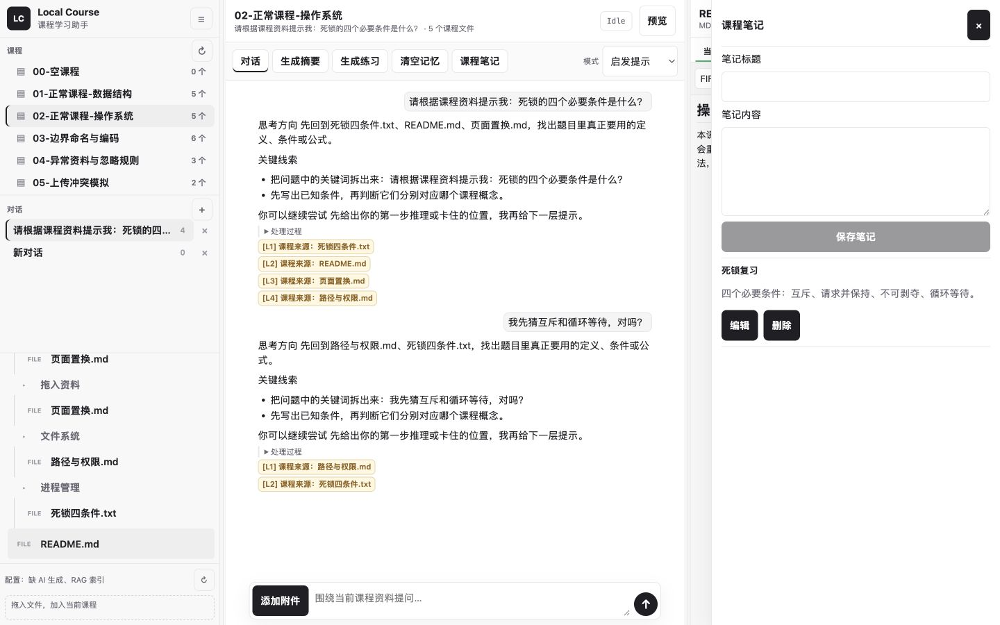

# 使用说明

本文对应当前 Vue 工作台，可作为课程设计报告中的“用户手册”章节。

## 1. 环境准备

必需环境：

- Windows 10/11、macOS 或 Linux。
- Python 3.9 或以上。
- Node.js 20.19+ 或 22.12+，并包含 npm。
- Chrome、Edge、Safari 等现代浏览器。
- 一个本地课程资料文件夹。

一键安装 Python 与前端依赖：

```bat
install-deps.bat
```

macOS/Linux：

```bash
chmod +x install-deps.sh start.sh
./install-deps.sh
```

安装器会创建 `.venv`，安装 `requirements.txt`，并按 `frontend/package-lock.json` 执行 npm 安装。项目的生产界面由 Vue 构建，因此 Node.js 和 npm 是运行完整应用的必要环境。

## 2. 准备配置

复制脱敏示例：

```bat
copy data\config.example.json data\config.json
```

macOS/Linux：

```bash
cp data/config.example.json data/config.json
```

主要字段：

- `root_folder`：课程资料根目录。
- `server.host` / `server.port`：默认 `127.0.0.1:8000`。
- `ai.base_url` / `ai.api_key` / `ai.model`：可选 OpenAI-compatible LLM。
- `ai.embedding_*`：可选真实 embedding；未配置时使用本地确定性 fallback。
- `ai.rerank_*`：可选外部 rerank；未完整配置时使用本地 rerank。
- `web_search`：可选 Web Search MCP，默认关闭。
- `mineru`：可选 MinerU API/CLI 解析。

真实 `data/config.json` 已被 Git 忽略。不要把密钥写入 `config.example.json`、截图或报告。

## 3. 准备课程资料

资料根目录下的一级文件夹就是课程：

```text
StudyMaterials/
├─ 操作系统/
│  ├─ 教材/chapter1.pdf
│  └─ notes.md
└─ 数据结构/
   ├─ stack.pdf
   └─ queue.txt
```

支持 PDF、TXT、Markdown、DOCX 和常见图片。PDF、图片、TXT 与 Markdown 可在右侧预览；DOCX 提取基础正文用于入库，复杂版式、扫描件和图片文字建议转 PDF 或使用 MinerU。TXT/Markdown 支持当前文件内搜索。

## 4. 启动系统

Windows：

```bat
start.bat
```

macOS/Linux：

```bash
./start.sh
```

启动脚本会校准依赖、构建前端到 `web/dist`，然后启动 Python 服务。浏览器访问：

```text
http://127.0.0.1:8000
```



## 5. 设置资料目录和构建知识库

1. 点击左栏品牌区右侧的设置菜单。
2. 输入课程资料根目录并点击“设置根目录”。
3. 选择课程后，再次打开设置菜单并点击“构建知识库”。
4. 等待状态提示完成；索引写入 `data/indexes/<course_id>.json` 和可选的 `.vector.json`。

侧栏底部只显示压缩的配置健康摘要；完整能力状态由 `GET /api/config/status` 返回。

## 6. 浏览课程、对话和文件

左栏从上到下依次是课程、对话、当前资料和配置/上传区：

1. 选择课程，加载该课程的对话和文件树。
2. 点击“对话”标题旁的 `+` 新建对话。
3. 单击对话切换；双击标题重命名；使用右侧删除按钮删除。
4. 点击文件树中的资料，在右侧打开预览。
5. TXT/Markdown 可输入关键词并用“上一个”“下一个”定位。
6. 把资料拖到左栏底部，可加入当前课程的 `拖入资料/`。





每个对话拥有独立消息和记忆；课程笔记、文件树和知识库由整门课程共享。旧版单会话数据会自动迁移到“历史对话”，详见 [`conversations-and-storage.md`](conversations-and-storage.md)。

## 7. 使用课程 Agent

中央工具栏提供三种模式：

- 答疑：先给结论，再解释依据。
- 启发提示：根据当前对话中的尝试逐级披露提示。
- 复习：组织知识结构、主动回忆和自测题。

发送问题后，ReAct planner 最多运行三轮，动态选择 `final`、澄清、课程检索、联网或组合工具。`final` 表示无需工具并交给最终 responder，不是最终答案已经完成。界面会显示当前思考、检索/联网状态、最终模型调用状态和回答增量；增量内容按安全 Markdown 实时渲染。

瞬时 LLM 请求错误最多共尝试五次，期间显示重试进度。持续失败会显示错误；已经输出 token 后不会重放请求。planner 显示 `final` 时表示“不需要工具、准备交给最终模型回答”，不是最终答案已经完成；随后界面会显示“正在调用最终模型生成回答…”。点击停止按钮可中断当前回答并保留已经显示的内容。

回答下方可能包含：

- `[L]` 课程引用，点击后在右侧打开本地资料。
- `[W]` 网页引用，点击后打开外部链接。
- “处理过程”，展示最终 trace。
- “当前思考”，在生成期间展示 planner action；`final` 后仍会等待最终 responder 的首个 token。



## 8. 附件和联网边界

点击“添加附件”或把文件拖到聊天区。文本附件加入当前请求上下文，图片会发送给已配置且支持视觉输入的模型。聊天附件保存在 `data/chat_uploads/<course_id>/`。

带附件的请求不会调用 Web Search MCP。普通问题只有在 `web_search.enabled=true` 且 ReAct 选择联网时才发送搜索查询；课程片段和附件正文不会发送给 MCP。其他外部服务的数据边界见 [`security-and-data-boundaries.md`](security-and-data-boundaries.md)。

## 9. 摘要、练习题和课程笔记

- “生成摘要”优先使用 map-reduce LLM pipeline；未配置模型时使用本地抽取式摘要。
- “生成练习”生成本地练习题。
- 两类产物写入课程目录 `AI生成/`，可预览但不会重新进入课程索引。
- “课程笔记”打开右侧抽屉，可新增、编辑、取消或删除笔记。



笔记保存在 `data/course_memory/<course_id>/notes.json`，不随对话切换。

## 10. 清空当前对话

点击“清空记忆”并确认，只会清空当前对话的消息和记忆：

```text
data/course_memory/<course_id>/conversations/<conversation_id>/
├─ messages.json
└─ memory.md
```

课程资料、其他对话、课程笔记和索引不会删除。对应接口为：

```text
POST /api/courses/{course_id}/conversations/{conversation_id}/memory/clear
```

旧客户端仍可调用 `POST /api/courses/{course_id}/memory/clear` 清空默认对话。

## 11. 后端保留能力

Dashboard 聚合和 mastery/错题 API 仍存在，但当前 Vue 界面没有“课程概览”或“掌握度”操作区，不能作为前端验收项：

- `GET /api/courses/{course_id}/dashboard`
- `GET/POST /api/courses/{course_id}/mastery`
- `POST /api/courses/{course_id}/mastery/mistakes/{mistake_id}/resolve`

学习计划核心代码也仍有遗留文件，但公开 `/plan` 路由和前端入口已移除。

## 12. 数据和备份

```text
data/
├─ config.json
├─ course_memory/<course_id>/
│  ├─ conversations.json
│  ├─ conversations/<conversation_id>/{messages.json,memory.md}
│  ├─ notes.json
│  └─ mastery.json
├─ chat_uploads/
├─ index_jobs.json
└─ indexes/{<course_id>.json,<course_id>.vector.json}
```

备份 CLI 只包含 `config.example.json`、`course_memory/**` 和 `indexes/**`。真实配置、聊天附件、SQLite 和缓存不会进入备份，详见 [`backup-and-migration.md`](backup-and-migration.md)。
