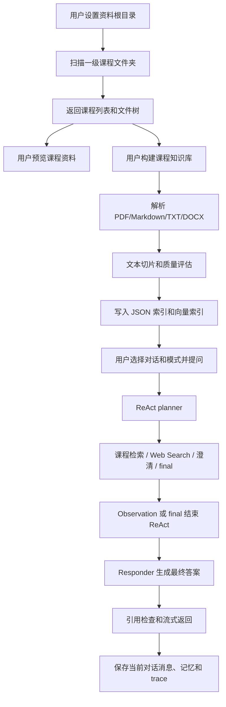
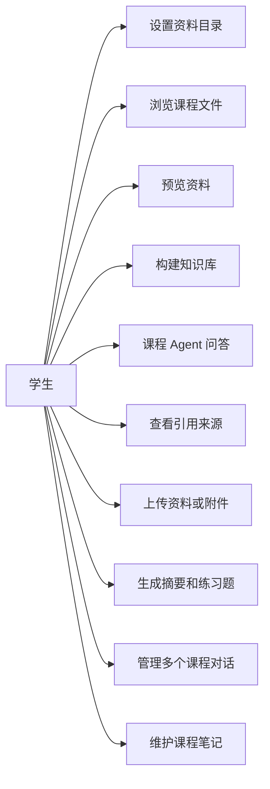
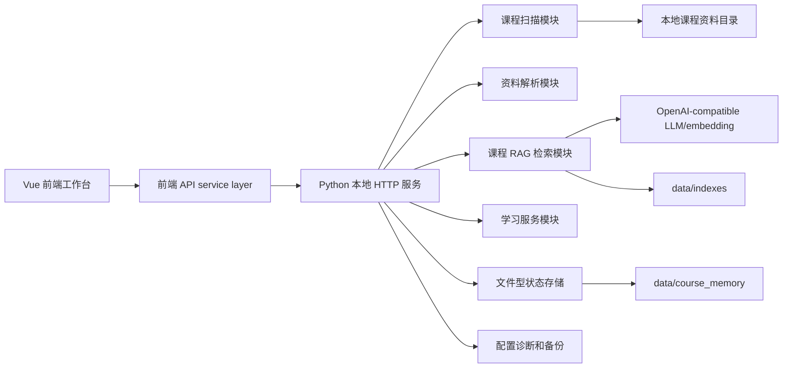
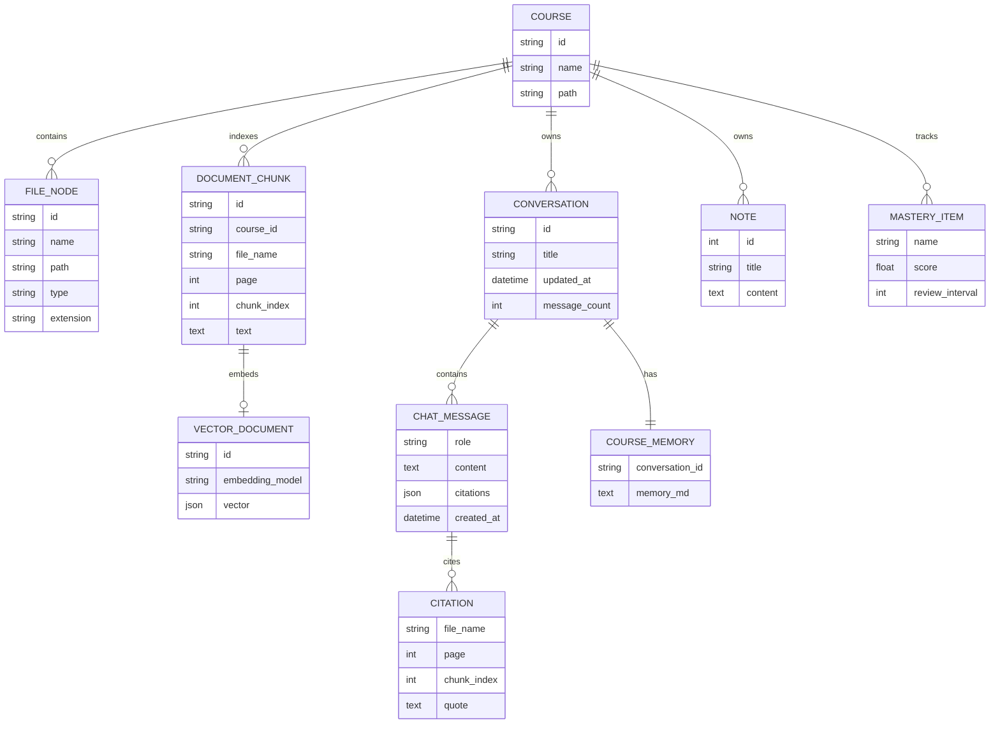
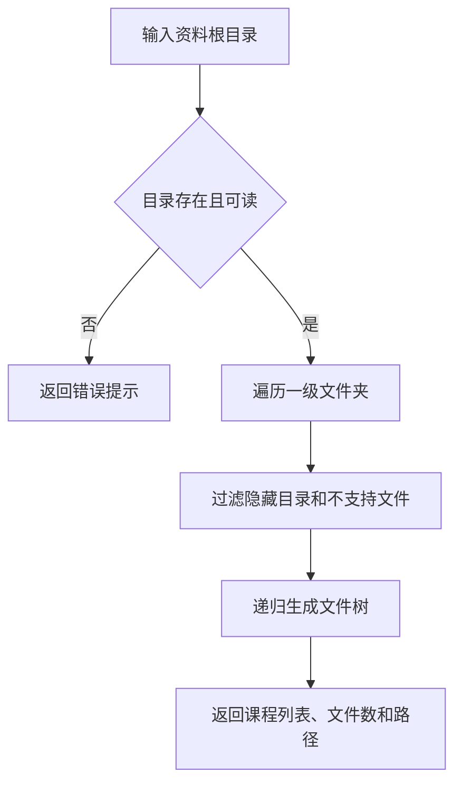
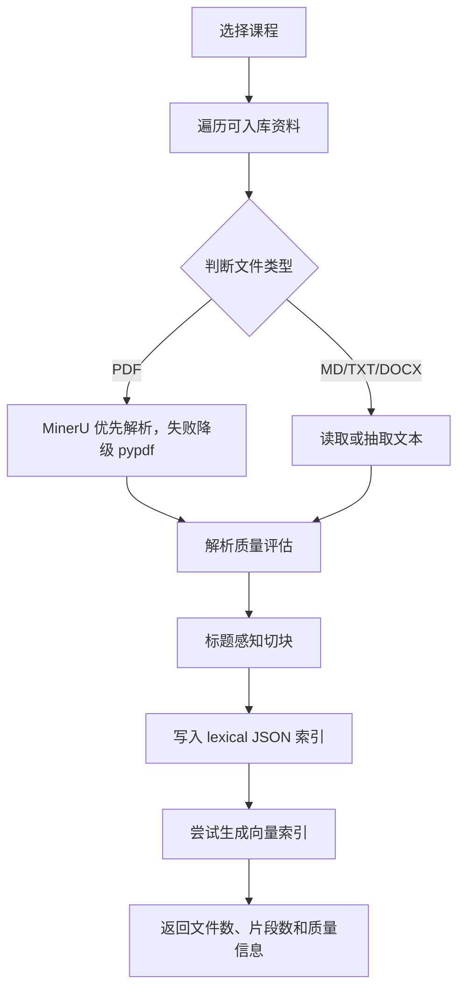
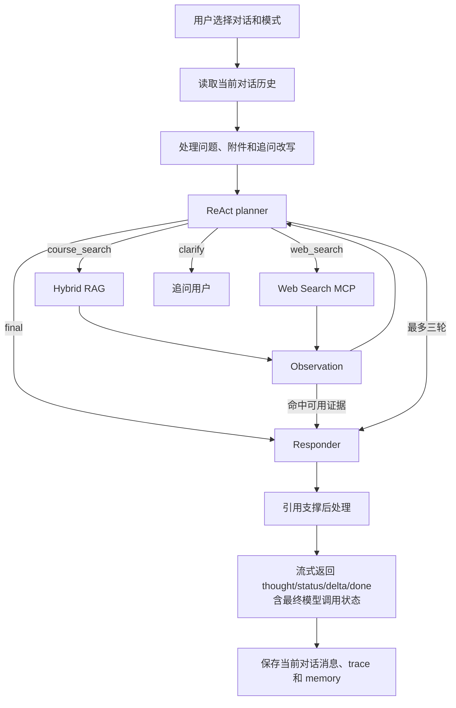
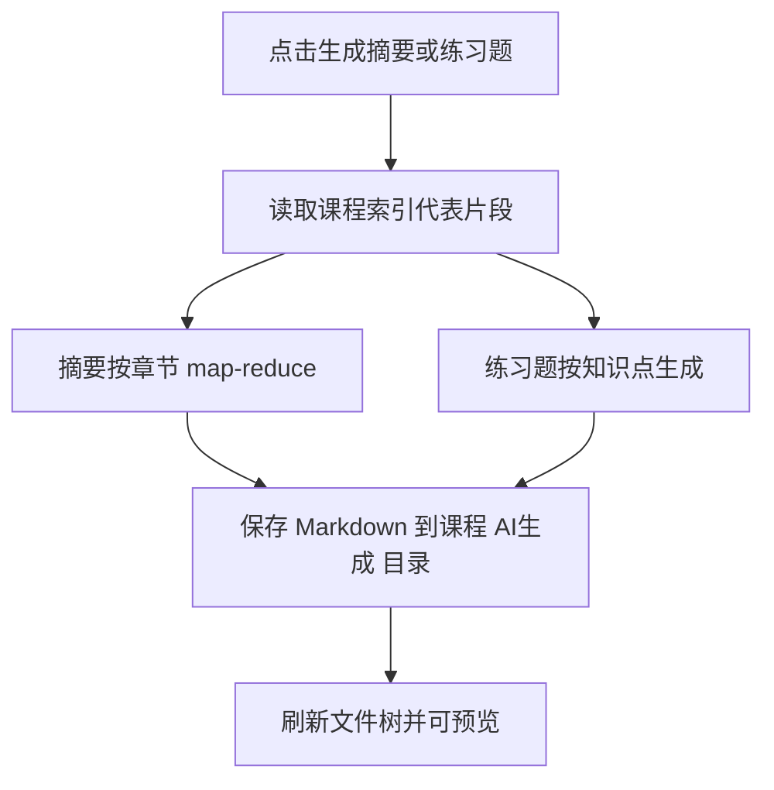

# 大型实习报告

题目：基于 RAG 的 Windows 本地课程资料库与 AI 学习助手系统设计与实现

小组成员：陆铭皓、王子欣、徐若轩、杨哲涵

## 第一章 封面

课程名称：夏季实训

项目名称：基于 RAG 的 Windows 本地课程资料库与 AI 学习助手系统设计与实现

项目类型：基于 Web 的管理系统与 AI 应用开发

小组成员：

| 姓名 | 主要职责 |
| --- | --- |
| 杨哲涵 | 组长、进度统筹、后端接口联调、验收演示、材料提交 |
| 陆铭皓 | RAG 核心开发、知识库构建、模型接入、系统联调 |
| 王子欣 | 前端功能开发、需求分析、用户手册、功能测试 |
| 徐若轩 | 学习功能开发、概要/详细设计图表、测试和报告格式整理 |

## 第二章 目的要求与内容

本项目面向学生日常复习和课程资料管理场景，设计并实现一个可在本地运行的课程资料库与 AI 学习助手。系统按照“一级文件夹 = 一门课程”的方式识别资料目录，支持 PDF、Markdown、TXT、DOCX 和图片等资料浏览；每门课程拥有独立知识库和课程笔记，并可建立多个彼此隔离的对话与记忆。

项目主要目标如下：

- 实现本地课程资料目录扫描和多级文件树展示。
- 支持 PDF、图片、文本和 Markdown 资料预览。
- 支持课程资料上传、聊天附件和截图问答。
- 为每门课程构建独立 RAG 知识库，回答时展示引用来源。
- 支持答疑、启发提示和复习三种模式，以及摘要、练习题和课程笔记。
- 提供配置健康状态、RAG 评测、备份恢复和测试用例，方便验收和后续维护。

## 第三章 可行性报告

### 3.1 技术可行性

项目采用 Python 标准库 HTTP 服务作为后端，Vue 3、TypeScript、Vite 和 Pinia 作为前端，文件型 JSON/Markdown 作为本地状态存储。核心技术均成熟稳定，适合课程设计周期内实现和演示。

RAG 部分采用文档解析、文本切片、BM25、RRF 融合、向量索引、本地 rerank、MMR 去重和引用后处理等策略。LLM、embedding、rerank、Web Search MCP 与 MinerU 都设计为可选能力；未配置时使用本地边界或保持关闭，已配置 LLM 的持续请求失败会明确反馈错误。

### 3.2 经济可行性

系统不要求部署云服务器，也不强制依赖 MySQL、Redis 或独立向量数据库。用户在本机安装 Python、Node.js 和浏览器后即可运行，课程资料和聊天记录都保存在本地，部署成本较低。

### 3.3 操作可行性

用户只需要准备一个课程资料根目录，系统会自动识别一级课程文件夹并展示文件树。主要操作集中在网页工作台中，包括设置目录、选择课程和对话、预览文件、构建知识库、选择学习模式、提问、生成摘要和保存笔记。

### 3.4 时间可行性

项目按四周实训周期拆分：第一周确定题目和需求，第二周完成基础资料扫描、预览和问答，第三周扩展 RAG 与学习功能原型，第四周完成多对话、三模式 ReAct、流式体验、范围收敛、测试和报告。学习计划和 mastery 前端原型在最终版本中不再作为公开 UI 能力。

## 第四章 需求分析

### 4.1 功能需求

| 编号 | 需求 | 说明 |
| --- | --- | --- |
| F01 | 资料根目录设置 | 用户可设置本地课程资料根目录 |
| F02 | 课程自动识别 | 根目录下一级文件夹自动识别为课程 |
| F03 | 文件树浏览 | 展示课程内多级目录和资料文件 |
| F04 | 文件预览 | 支持 PDF、图片、TXT、Markdown 预览 |
| F05 | 课程知识库构建 | 对每门课程独立解析、切片和建立索引 |
| F06 | 课程 Agent 问答 | 用户围绕当前课程资料提问 |
| F07 | 引用来源展示 | 回答展示文件名、页码或片段编号 |
| F08 | 附件和截图问答 | 支持聊天框拖入文本附件和图片 |
| F09 | 摘要和练习题生成 | 生成 Markdown 学习产物并保存到课程目录 |
| F10 | 多对话和课程笔记 | 对话独立保存消息/记忆，课程共享笔记 |
| F11 | 配置诊断 | 展示 AI、MinerU、Web Search、索引、向量等配置状态 |
| F12 | 备份恢复 | 支持本地数据 zip 备份和恢复 |

### 4.2 非功能需求

- 本地部署：系统默认运行在 `127.0.0.1:8000`。
- 数据隔离：不同课程的索引和笔记互不混淆，同课程不同对话的消息与记忆也彼此隔离。
- 可追溯：AI 回答必须展示可复核的课程来源。
- 可诊断：未配置外部模型时使用本地边界；已配置服务失败时显示重试或错误状态。
- 配置安全：真实 `data/config.json` 不提交，仓库只保留 `data/config.example.json`。
- 易维护：后端按 API、retrieval、learning、store、ops 等职责分层。

### 4.3 数据流图

### 4.4 用例图

## 第五章 概要设计

### 5.1 系统结构

### 5.2 前后端接口划分

| 方法 | 路径 | 功能 |
| --- | --- | --- |
| GET | `/api/config` | 读取资料根目录和配置状态 |
| POST | `/api/config` | 设置资料根目录 |
| GET | `/api/config/status` | 返回配置健康状态 |
| GET | `/api/courses` | 获取课程列表和文件树 |
| GET | `/api/files/preview?id=` | 预览课程文件 |
| POST | `/api/courses/{course_id}/files` | 上传课程资料 |
| POST | `/api/courses/{course_id}/index` | 构建课程知识库 |
| GET/POST | `/api/courses/{course_id}/conversations` | 列出或新建对话 |
| POST | `/api/courses/{course_id}/conversations/{conversation_id}` | 重命名对话 |
| POST | `/api/courses/{course_id}/conversations/{conversation_id}/delete` | 删除对话 |
| POST | `/api/courses/{course_id}/conversations/{conversation_id}/chat` | 指定对话问答 |
| POST | `/api/courses/{course_id}/conversations/{conversation_id}/memory/clear` | 清空指定对话 |
| GET/POST | `/api/courses/{course_id}/summary` | 生成课程摘要 |
| GET/POST | `/api/courses/{course_id}/quiz` | 生成练习题 |
| GET/POST | `/api/courses/{course_id}/notes` | 管理课程笔记 |
| GET/POST | `/api/courses/{course_id}/mastery` | 后端掌握度状态，当前前端未展示 |

### 5.3 存储设计

项目不强制使用数据库，主要本地数据保存在 `data/`：

- `data/config.example.json`：脱敏配置示例。
- `data/config.json`：用户真实本地配置，不提交。
- `data/indexes/*.json`：课程文本索引。
- `data/indexes/*.vector.json`：课程向量索引。
- `data/course_memory/<course_id>/conversations.json`：对话清单和元数据。
- `data/course_memory/<course_id>/conversations/<conversation_id>/messages.json`：对话消息。
- `data/course_memory/<course_id>/conversations/<conversation_id>/memory.md`：对话记忆。
- `data/course_memory/<course_id>/notes.json`：课程笔记。
- `data/course_memory/<course_id>/mastery.json`：后端掌握度和错题状态，当前前端未展示。

## 第六章 详细设计

### 6.1 E-R 图

### 6.2 课程扫描流程

### 6.3 知识库构建流程

### 6.4 Agent 问答流程

### 6.5 摘要和练习题流程

## 第七章 程序模块

| 模块 | 文件 | 职责 |
| --- | --- | --- |
| 前端工作台 | `frontend/src/components/`、`stores/` | 三栏布局、课程/对话/文件树、预览、聊天和笔记 |
| API service layer | `frontend/src/services/api.ts` | 封装 JSON、上传、SSE/NDJSON 流式响应 |
| HTTP 服务 | `local_course_agent/server.py`、`local_course_agent/api/*` | 路由、请求解析、静态资源、课程和聊天 API |
| 课程扫描 | `local_course_agent/scanner.py` | 按一级文件夹识别课程并生成文件树 |
| 文档解析 | `local_course_agent/parser/` | PDF、TXT、Markdown、DOCX 解析 |
| RAG 检索 | `local_course_agent/retrieval/` | 切片、索引、检索、引用、向量融合和评测 |
| 学习服务 | `local_course_agent/learning/` | 索引任务、摘要、练习题和后端 dashboard/mastery |
| 文件型状态 | `local_course_agent/store/`、`storage/` | 多对话、消息、记忆、笔记和迁移 |
| 运行维护 | `local_course_agent/ops/` | 配置健康、telemetry、备份恢复 |

关键代码摘录可使用 `docs/夏季实训提交材料/程序模块与代码摘录.md` 中的内容。报告正文中建议只放 2 到 4 段核心代码，每段不超过半页。

## 第八章 测试与用户手册

### 8.1 测试用例

| 编号 | 测试项 | 输入或操作 | 预期结果 | 实际结果 |
| --- | --- | --- | --- | --- |
| T01 | 启动系统 | 运行 `start.bat` 或 `./start.sh` | 浏览器可访问系统首页 | 以 `docs/acceptance-report.md` 为准 |
| T02 | 资料目录设置 | 输入课程资料根目录 | 左侧显示课程列表 | 以 `docs/acceptance-report.md` 为准 |
| T03 | 课程识别 | 点击课程名 | 展开多级文件树 | 以 `docs/acceptance-report.md` 为准 |
| T04 | 文件预览 | 点击 MD/TXT/图片/PDF | 右侧预览区显示资料内容 | 以 `docs/acceptance-report.md` 为准 |
| T05 | 课程资料上传 | 拖入课程资料 | 文件保存到课程目录 | 以 `docs/acceptance-report.md` 为准 |
| T06 | 知识库构建 | 点击“构建知识库” | 返回入库文件数和片段数 | 以 `docs/acceptance-report.md` 为准 |
| T07 | 课程问答 | 输入课程问题 | 返回答案和课程引用 | 以 `docs/acceptance-report.md` 为准 |
| T08 | 课程隔离 | 切换课程后提问 | 记录、记忆、索引不混淆 | 以 `docs/acceptance-report.md` 为准 |
| T09 | 附件问答 | 拖入文本附件并提问 | 附件参与当前课程问题 | 以 `docs/acceptance-report.md` 为准 |
| T10 | 截图问答 | 拖入图片 | 图片作为视觉内容块参与提问 | 以 `docs/acceptance-report.md` 为准 |
| T11 | 摘要生成 | 点击“生成摘要” | 生成 Markdown 摘要文件 | 以 `docs/acceptance-report.md` 为准 |
| T12 | 练习题生成 | 点击“生成练习题” | 生成 Markdown 练习题文件 | 以 `docs/acceptance-report.md` 为准 |
| T13 | 笔记管理 | 新增、编辑、删除笔记 | `notes.json` 正确更新 | 以 `docs/acceptance-report.md` 为准 |
| T14 | 多对话 | 新建并切换对话 | 消息和记忆互不混淆 | 以 `docs/acceptance-report.md` 为准 |
| T15 | 三模式 ReAct | 切换模式并查看当前思考 | 工具决策和回答策略变化 | 以 `docs/acceptance-report.md` 为准 |
| T16 | 自动化测试 | 运行 Python、前端和 RAG 门禁 | 结果完整记录 | 以 `docs/acceptance-report.md` 为准 |

### 8.2 用户手册

1. 安装 Python 3.9+、Node.js 20.19+ 或 22.12+、npm 和现代浏览器。
2. Windows 运行 `install-deps.bat`，macOS/Linux 运行 `./install-deps.sh`。
3. 复制 `data/config.example.json` 为 `data/config.json`，填写资料根目录和可选模型配置。
4. 运行 `start.bat` 或 `./start.sh`。
5. 浏览器访问 `http://127.0.0.1:8000`。
6. 在左栏设置菜单中设置资料根目录并构建知识库。
7. 选择课程，新建或切换对话，展开文件树并预览资料。
8. 选择答疑、启发提示或复习模式后提问。
9. 查看当前思考、流式回答、引用来源和处理过程。
10. 使用“生成摘要”“生成练习题”“课程笔记”和“清空当前对话”。

### 8.3 功能截图

报告中可插入以下真实截图：

| 图号 | 文件 | 说明 |
| --- | --- | --- |
| 图 8-1 | `docs/screenshots/01-首页总览.png` | 首页、资料根目录、课程列表 |
| 图 8-2 | `docs/screenshots/02-课程展开与文件树.png` | 课程、多个对话和文件树 |
| 图 8-3 | `docs/screenshots/03-文本资料预览.png` | Markdown/TXT 预览和搜索 |
| 图 8-4 | `docs/screenshots/04-课程Agent问答记录.png` | 三模式、当前思考、回答和引用 |
| 图 8-5 | `docs/screenshots/05-课程笔记抽屉.png` | 课程笔记抽屉 |

## 第九章 个人体会

### 陆铭皓

我主要参与 RAG 核心链路、知识库构建、模型接入和系统联调，包括资料解析后的切片、检索融合、引用来源组织和问答流程调试。本项目让我更清楚地理解了 RAG 系统不是简单调用大模型，而是由资料解析、切片、索引、检索、引用和提示词共同构成。实现中最需要控制的是回答范围，系统必须优先依据当前课程资料，证据不足时给出提示，而不是让模型凭常识自由发挥。

### 王子欣

我主要参与前端功能开发、需求分析、测试用例和用户手册整理，重点关注课程列表、资料预览、课程问答入口和用户操作流程。通过梳理使用流程，我认识到学习助手不仅要“能回答”，还要让普通用户知道资料从哪里来、怎么复核答案、怎么保存笔记和继续复习。测试过程中也发现，课程隔离、文件预览、引用展示这些细节直接影响系统可信度。

### 徐若轩

我主要参与学习功能开发、概要设计、详细设计图表、测试和报告格式整理，重点梳理摘要、练习题以及学习计划和 mastery 原型。最终产品收敛时，学习计划公开 UI/API 和 mastery 前端操作区被移除，这让我认识到报告必须区分曾开发的原型、仍保留的后端能力和最终可验收功能。整理多对话、ReAct、数据流图和 E-R 图时，我对从用户操作到后端索引再到 AI 回答的完整流程有了更系统的认识。

### 杨哲涵

我作为组长主要负责进度统筹、接口联调配合、可行性分析、验收演示流程和材料提交，同时参与配置诊断、备份恢复和演示环境检查。这个项目的优势是部署成本低、演示路径清楚，适合学生在本地管理自己的课程资料。当前仍有不足，例如复杂扫描 PDF 和真实语义召回效果会受到外部解析与 embedding 配置影响，后续可以继续增强 OCR、错题本和学习效果闭环。

## 参考文献

[1] Lewis P, Perez E, Piktus A, et al. Retrieval-Augmented Generation for Knowledge-Intensive NLP Tasks. NeurIPS, 2020.

[2] Vue.js 官方文档. https://vuejs.org/

[3] Vite 官方文档. https://vite.dev/

[4] Python 官方文档. https://docs.python.org/3/

[5] OpenAI API Documentation. https://platform.openai.com/docs/
