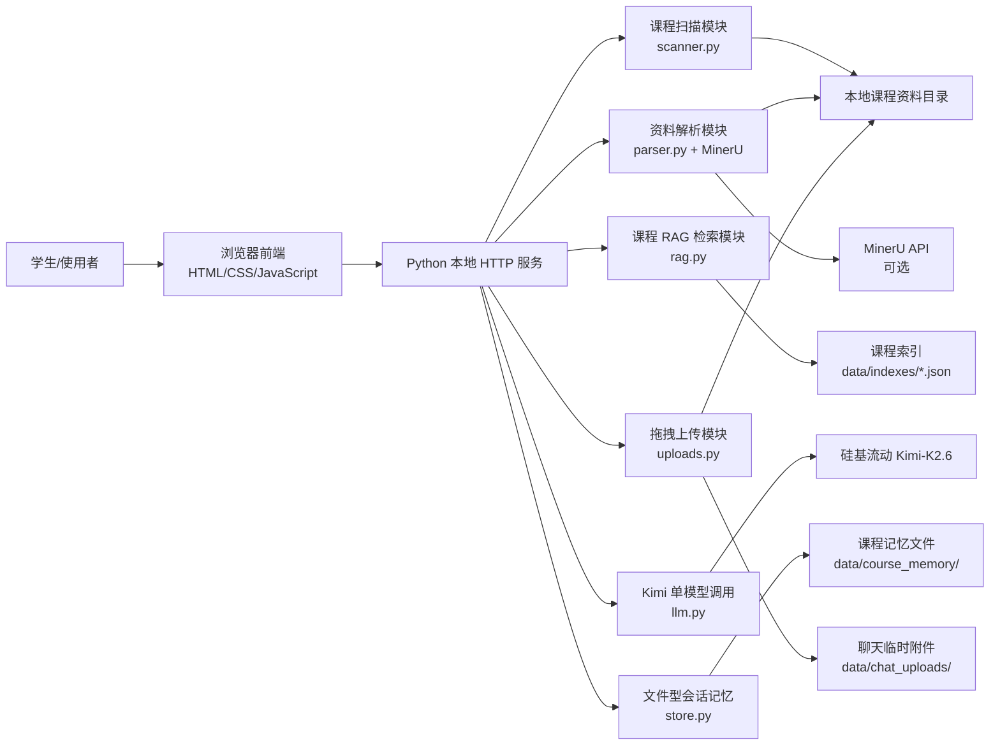
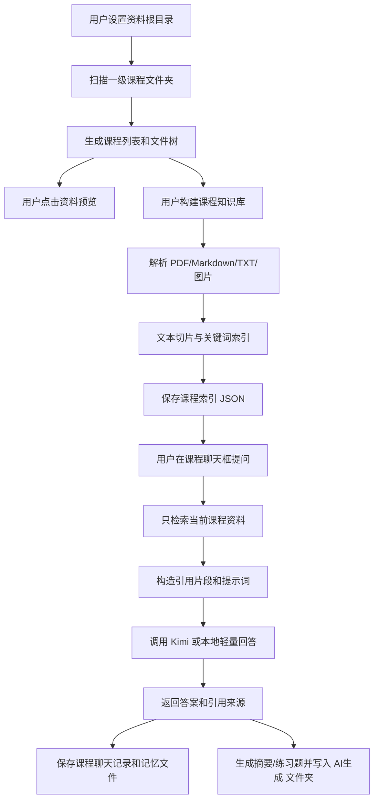
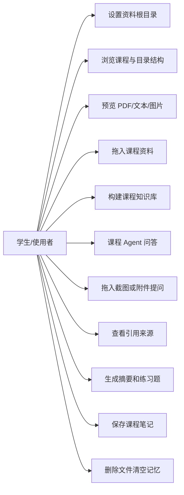
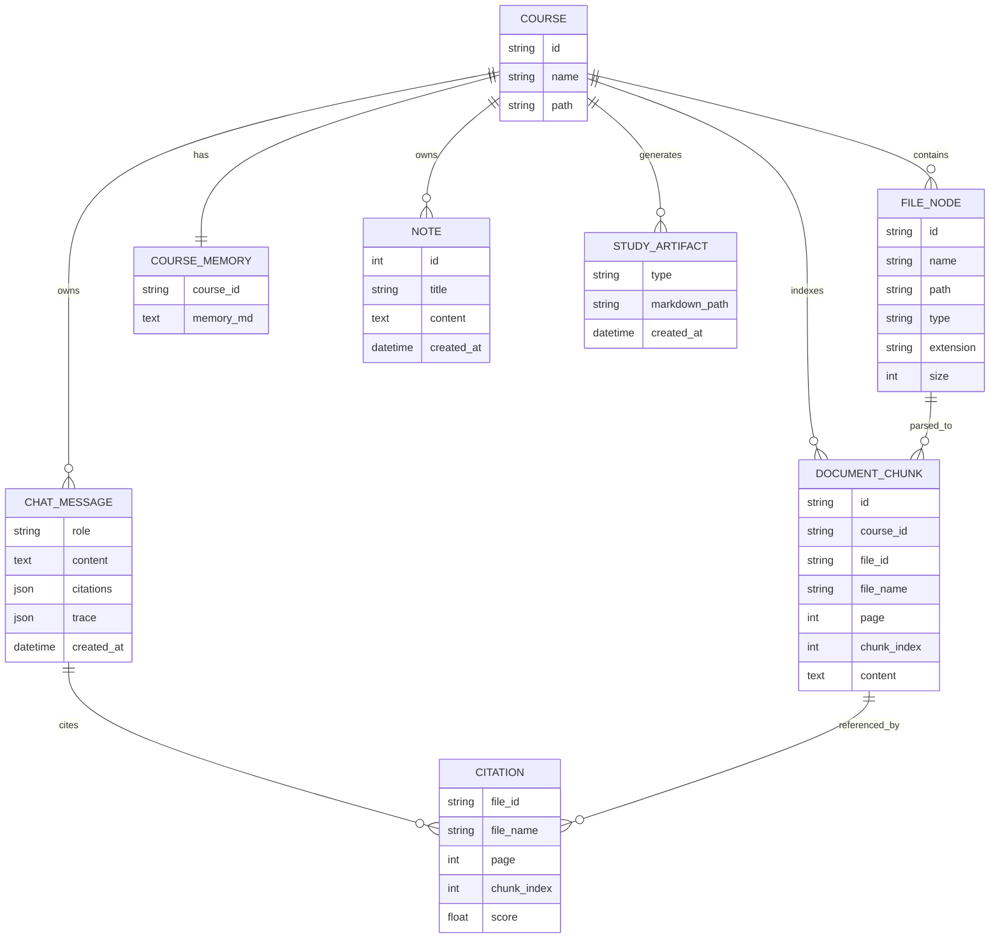
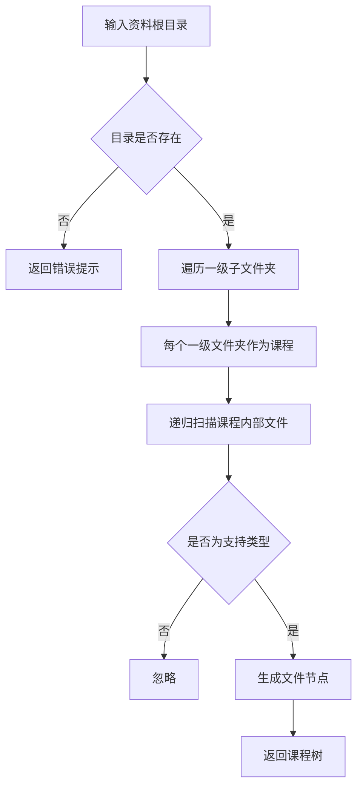
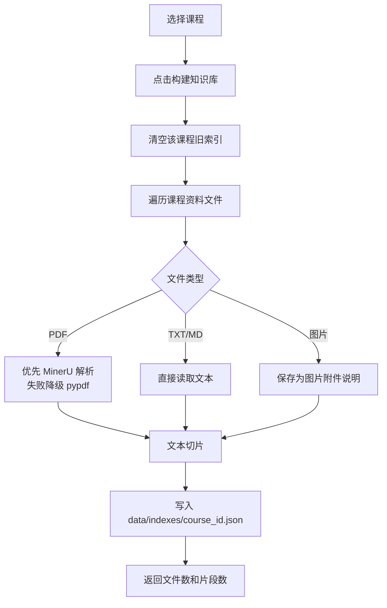
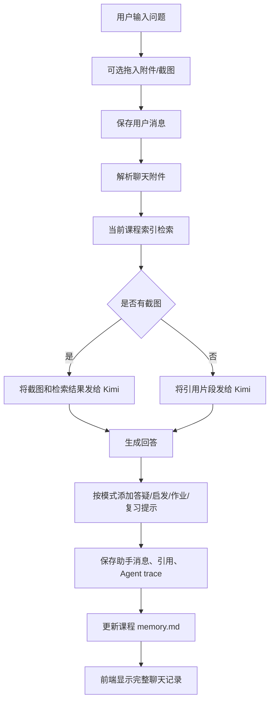
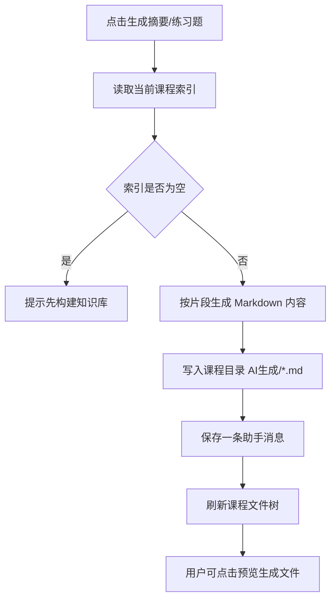

# 系统设计

本文用于课程设计报告的“需求分析、概要设计、详细设计”章节，可直接引用其中的图表和说明。

## 1. 总体架构图

设计说明：

- 系统采用本地 Web 方式运行，用户通过浏览器访问 `http://127.0.0.1:8000`。
- 后端使用 Python 标准库 HTTP 服务，避免复杂部署。
- 课程资料来自本地文件夹，一级文件夹识别为课程。
- 每门课程拥有独立文件树、独立知识库、独立聊天记录和独立记忆。
- 大模型只使用一套 Kimi 配置，文本问答和截图问答都走同一个 OpenAI-compatible 接口。
- 运行数据保存在 `data/` 下，真实配置和聊天记录不会提交到仓库。

## 2. 需求数据流图

## 3. 用例图

## 4. E-R 图

实现说明：

- `COURSE` 和 `FILE_NODE` 由本地目录实时扫描生成。
- `DOCUMENT_CHUNK` 存储在 `data/indexes/<course_id>.json`。
- `CHAT_MESSAGE` 存储在 `data/course_memory/<course_id>/messages.json`。
- `COURSE_MEMORY` 存储在 `data/course_memory/<course_id>/memory.md`。
- `NOTE` 存储在 `data/course_memory/<course_id>/notes.json`。
- `STUDY_ARTIFACT` 对应课程目录下的 `AI生成/*.md`。

## 5. 关键流程图

### 5.1 课程扫描流程

### 5.2 知识库构建流程

### 5.3 Agent 问答流程

### 5.4 摘要与练习题生成流程

## 6. 前后端接口划分

| 方法 | 路径 | 功能 |
| --- | --- | --- |
| GET | `/api/config` | 读取资料根目录和配置状态，不返回密钥 |
| POST | `/api/config` | 设置资料根目录 |
| GET | `/api/courses` | 扫描课程列表和文件树 |
| GET | `/api/files/preview?id=` | 预览 PDF、文本、图片 |
| POST | `/api/courses/{course_id}/index` | 构建课程知识库 |
| GET | `/api/courses/{course_id}/messages` | 获取课程聊天记录 |
| POST | `/api/courses/{course_id}/chat` | 课程问答，支持附件和截图 |
| GET | `/api/courses/{course_id}/memory` | 获取课程记忆文件内容 |
| POST | `/api/courses/{course_id}/summary` | 生成摘要并保存到课程目录 |
| POST | `/api/courses/{course_id}/quiz` | 生成练习题并保存到课程目录 |
| GET | `/api/courses/{course_id}/notes` | 获取课程笔记 |
| POST | `/api/courses/{course_id}/notes` | 保存课程笔记 |

## 7. 模块划分

| 模块 | 文件 | 职责 |
| --- | --- | --- |
| 课程扫描 | `scanner.py` | 将一级文件夹识别为课程，生成多级文件树 |
| 文档解析 | `parser.py`、`mineru_api.py` | 解析 PDF/文本/图片，优先 MinerU，失败降级 |
| RAG 检索 | `rag.py` | 文本切片、关键词评分、引用生成、摘要和练习题生成 |
| 大模型调用 | `llm.py` | 调用 Kimi OpenAI-compatible 接口，支持文本和图片内容块 |
| 文件记忆 | `store.py` | 用 JSON/Markdown 保存聊天、记忆、笔记 |
| 上传管理 | `uploads.py` | 保存课程资料拖拽上传和聊天临时附件 |
| HTTP 服务 | `server.py` | 路由 API、协调扫描、解析、检索、生成和预览 |
| 前端交互 | `web/` | 三栏 Agent 工作台、文件树、预览、聊天、笔记抽屉 |

