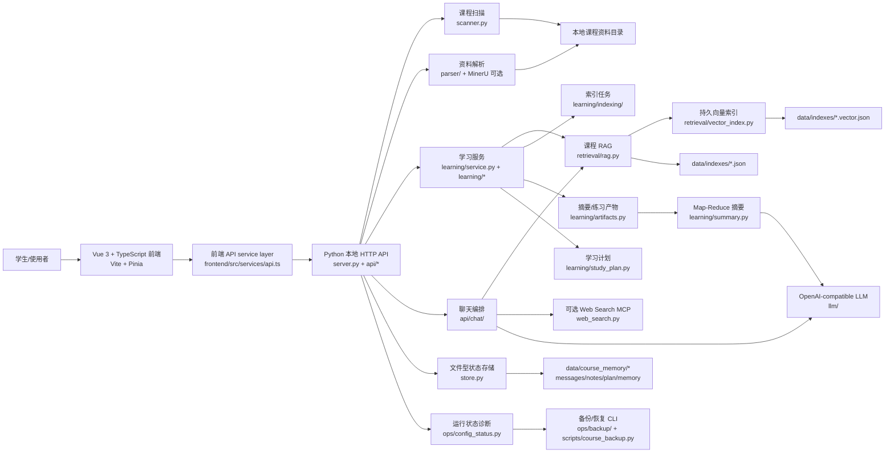
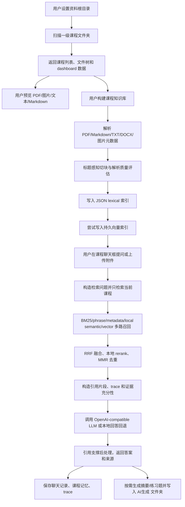
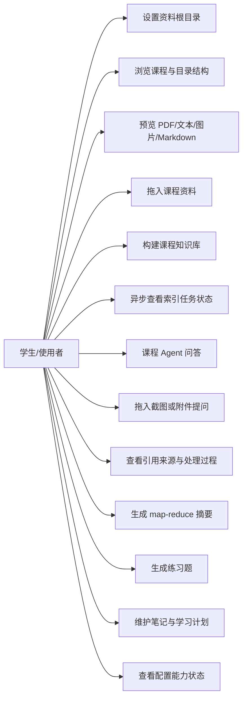
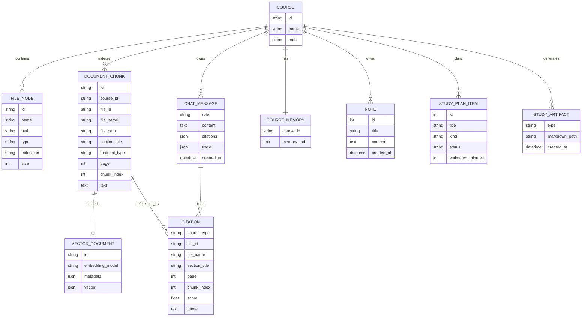
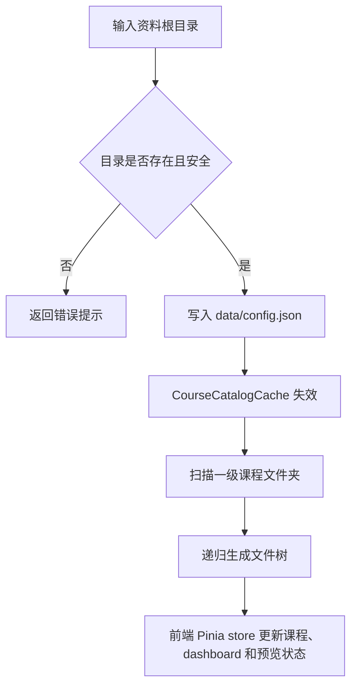
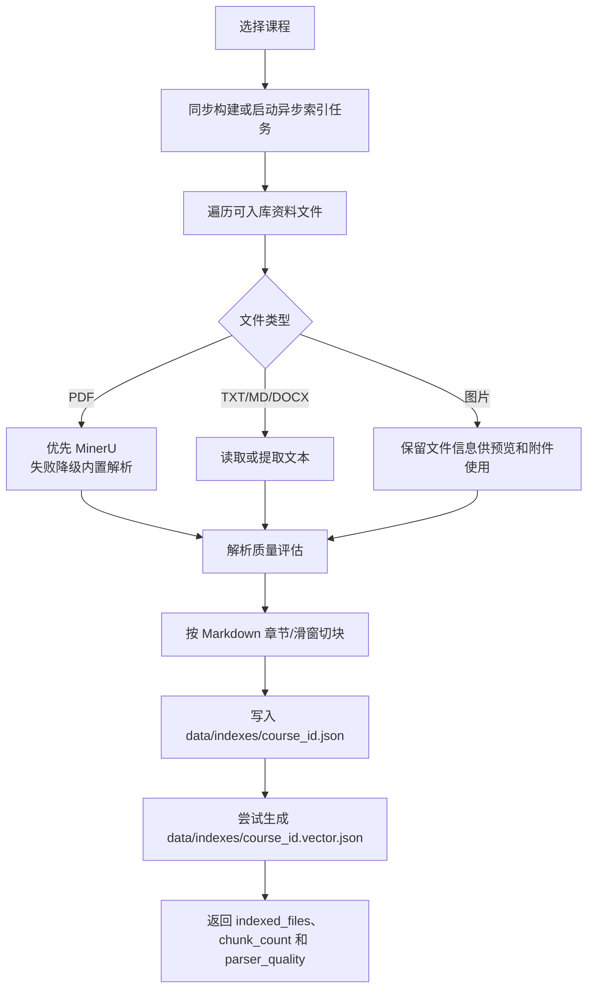
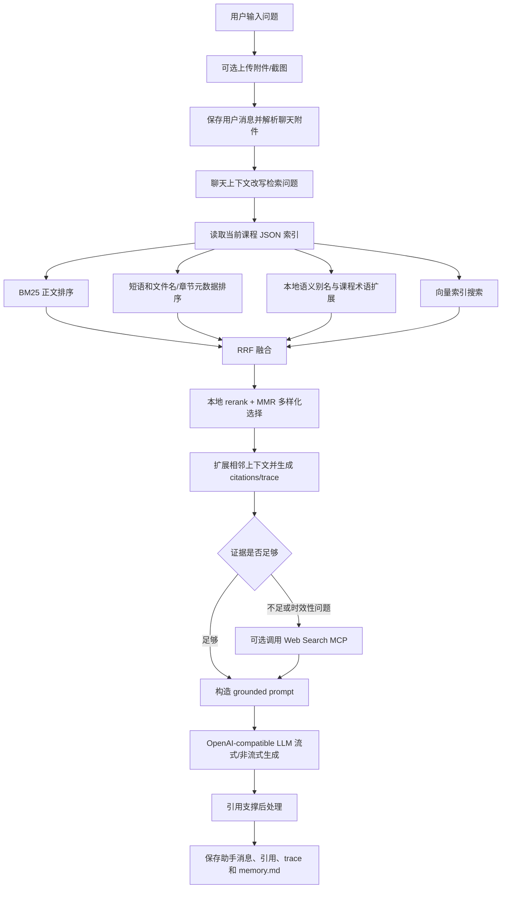
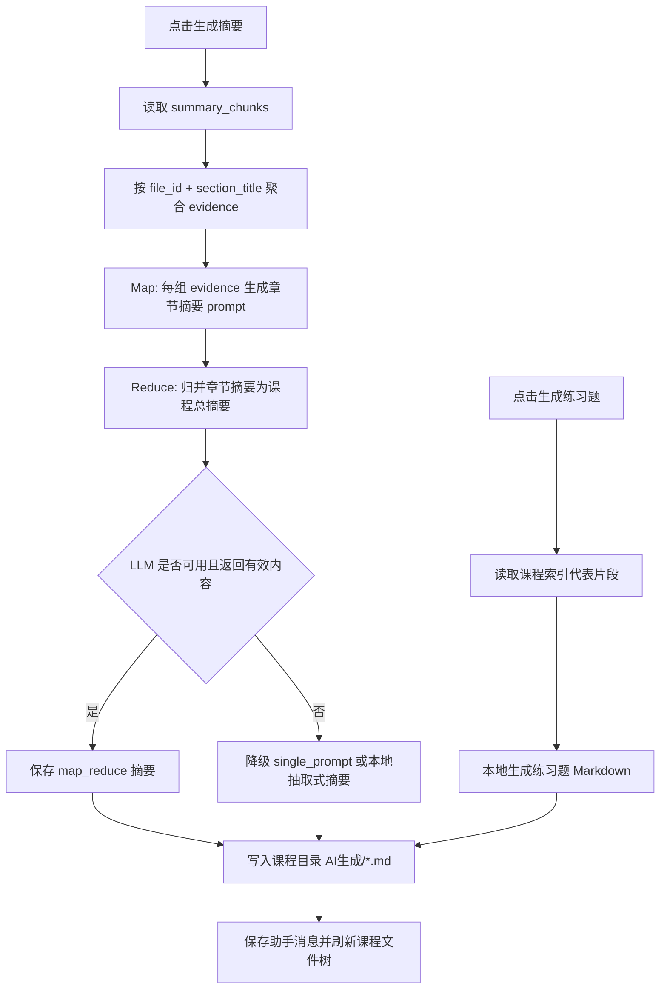
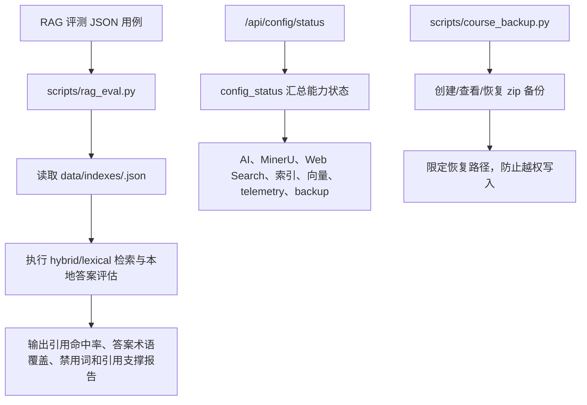

# 系统设计

本文用于课程设计报告的“需求分析、概要设计、详细设计”章节。内容按当前仓库实现更新，描述 Vue 前端、API service layer、hybrid RAG、OpenAI-compatible 模型接入、摘要、评测、诊断与备份等当前能力。

## 1. 总体架构图

设计说明：

- 系统采用本地 Web 工作台方式运行，用户通过浏览器访问 `http://127.0.0.1:8000`。
- 前端是 Vue 3、TypeScript、Vite 和 Pinia，`frontend/src/services/api.ts` 统一封装 JSON、文件上传和 SSE/NDJSON 流式接口。
- 后端使用 Python 标准库 `ThreadingHTTPServer` 提供本地 HTTP API，`server.py` 保留 Handler glue，`local_course_agent/api/*` 承接上下文、静态资源、系统接口、课程接口和聊天编排。
- 课程资料来自本地文件夹，一级文件夹识别为课程；每门课程拥有独立文件树、知识库索引、聊天记录、记忆、笔记和学习计划。
- LLM 和 embedding 均采用 OpenAI-compatible 配置，具体模型由 `data/config.json` 决定；未配置模型时会回退到本地检索/抽取式能力。
- RAG 默认走 hybrid 策略：标题感知切块、BM25、短语/元数据/本地语义排名、RRF 融合、持久向量索引、MMR 去重和相邻上下文扩展。
- 运行数据保存在 `data/` 下，真实配置、聊天记录、索引和上传附件不会提交到仓库。

## 2. 需求数据流图

## 3. 用例图

## 4. E-R 图

实现说明：

- `COURSE` 和 `FILE_NODE` 由 `scanner.py` 对本地目录实时扫描生成，并通过 `CourseCatalogCache` 缓存。
- `DOCUMENT_CHUNK` 存储在 `data/indexes/<course_id>.json`，索引记录 schema/tokenizer 版本、章节标题、资料类型和来源路径。
- `VECTOR_DOCUMENT` 存储在 `data/indexes/<course_id>.vector.json`；配置真实 embedding provider 时调用 OpenAI-compatible `/embeddings`，否则使用本地确定性 hash embedding。
- `CHAT_MESSAGE`、`COURSE_MEMORY`、`NOTE`、`STUDY_PLAN_ITEM` 存储在 `data/course_memory/<course_id>/`。
- `STUDY_ARTIFACT` 对应课程资料目录下的 `AI生成/*.md`。
- 备份/恢复能力覆盖 `config.json`、`course_memory/`、`indexes/` 和 `chat_uploads/` 等本地数据文件，入口是 `local_course_agent.ops.backup` 与 `scripts/course_backup.py`。

## 5. 关键流程图

### 5.1 课程扫描与前端状态流程

### 5.2 知识库构建流程

### 5.3 Hybrid RAG 问答流程

### 5.4 Map-Reduce 摘要与练习题流程

### 5.5 评测、诊断和备份流程

## 6. 前后端接口划分

| 方法 | 路径 | 功能 |
| --- | --- | --- |
| GET | `/api/config` | 读取资料根目录和配置状态，不返回密钥 |
| POST | `/api/config` | 设置资料根目录 |
| GET | `/api/config/status` | 返回 AI、解析、索引、向量、遥测和备份能力状态 |
| GET | `/api/courses` | 扫描课程列表和文件树 |
| GET | `/api/files/preview?id=` | 预览 PDF、文本、图片和 Markdown 原始文件 |
| POST | `/api/courses/{course_id}/files` | 上传课程资料并刷新课程树 |
| POST | `/api/courses/{course_id}/index` | 同步构建课程知识库 |
| POST | `/api/courses/{course_id}/index/jobs` | 启动异步索引任务 |
| GET | `/api/index-jobs/{job_id}` | 查询异步索引任务状态 |
| GET | `/api/courses/{course_id}/messages` | 获取课程聊天记录 |
| POST | `/api/courses/{course_id}/chat` | 课程问答，支持 JSON、multipart、SSE 和 NDJSON 流式响应 |
| GET | `/api/courses/{course_id}/memory` | 获取课程记忆文件内容 |
| GET | `/api/courses/{course_id}/summary` | 即时生成摘要 payload，不写入课程目录 |
| POST | `/api/courses/{course_id}/summary` | 生成摘要并保存到课程目录 |
| GET | `/api/courses/{course_id}/quiz` | 即时生成练习题 payload，不写入课程目录 |
| POST | `/api/courses/{course_id}/quiz` | 生成练习题并保存到课程目录 |
| GET | `/api/courses/{course_id}/notes` | 获取课程笔记 |
| POST | `/api/courses/{course_id}/notes` | 保存课程笔记 |
| GET | `/api/courses/{course_id}/plan` | 获取课程学习计划 |
| POST | `/api/courses/{course_id}/plan` | 新增学习计划项 |
| POST | `/api/courses/{course_id}/plan/{item_id}` | 更新学习计划项状态或内容 |
| GET | `/api/courses/{course_id}/dashboard` | 获取课程进度、资料、活动和复习队列概览 |
| GET | `/api/courses/{course_id}/mastery` | 获取知识点掌握度和错题状态 |
| POST | `/api/courses/{course_id}/mastery` | 新增知识点或写入一次答题结果 |

## 7. 模块划分

| 模块 | 文件 | 职责 |
| --- | --- | --- |
| 前端工作台 | `frontend/src/*.vue`、`frontend/src/stores/*` | 三栏课程工作台、文件树、预览、聊天、笔记、学习计划和状态面板 |
| 前端 API 层 | `frontend/src/services/api.ts` | 统一封装 JSON 请求、文件上传、SSE/NDJSON 流式解析和错误处理 |
| HTTP 入口 | `local_course_agent/server.py`、`local_course_agent/api/router.py`、`api/http.py` | `ThreadingHTTPServer`、Handler glue、课程路由匹配/分发、请求解析和流式响应适配 |
| 系统 API 支撑 | `local_course_agent/api/context.py`、`api/static.py`、`api/system.py` | AppContext、资料根目录安全边界、静态资源路径/cache 策略、配置/status/预览接口逻辑 |
| 课程 API 编排 | `local_course_agent/api/course/` | 索引、上传、摘要、练习题、笔记、学习计划和 dashboard API 适配 |
| 聊天 API 编排 | `local_course_agent/api/chat/`、`api/telemetry.py` | 附件入库、会话上下文、课程检索、联网补充、LLM 生成、引用后处理和请求级 telemetry |
| 课程扫描 | `local_course_agent/scanner.py` | 将一级文件夹识别为课程，生成多级文件树并缓存 |
| 文档解析 | `local_course_agent/parser/`、`mineru_api.py`、`ingestion/parser_quality.py` | 解析 PDF/文本/Markdown/DOCX，接入 MinerU 可选解析并输出质量状态 |
| 学习服务门面 | `local_course_agent/learning/service.py` | 保持旧 import 兼容，薄包装索引、学习计划、学习产物和文件工具 |
| 学习索引服务 | `local_course_agent/learning/indexing/` | 构建课程索引、解析质量统计、索引任务队列、进度回调和任务快照恢复 |
| 学习产物服务 | `local_course_agent/learning/artifacts.py` | 生成摘要/练习题、保存 `AI生成` 产物、写入助手消息和摘要 fallback 编排 |
| 学习计划服务 | `local_course_agent/learning/study_plan.py` | 基于课程文件生成默认学习计划、任务排序、计划统计和 next item 计算 |
| 学习文件工具 | `local_course_agent/learning/files.py` | 课程文件遍历、AI 生成目录过滤和学习产物落盘 |
| 掌握度模型 | `local_course_agent/learning/mastery.py` | 知识点、掌握分、错题和复习间隔的纯数据模型 |
| Map-Reduce 摘要 | `local_course_agent/learning/summary.py` | evidence 规范化、章节分组、map/reduce prompt 构造和 LLM 摘要执行 |
| RAG 编排 | `local_course_agent/retrieval/rag.py` | 知识库持久化、检索编排、引用生成、摘要/练习题本地 fallback |
| RAG 切片与排序 | `local_course_agent/retrieval/chunking.py`、`retrieval/query.py`、`retrieval/scoring.py`、`retrieval/selection.py`、`retrieval/ranking.py` | 标题感知切块、query normalization/expansion、BM25/短语/元数据/本地语义排序、RRF/vector merge、多样性选择和旧入口兼容 |
| 向量检索 | `local_course_agent/retrieval/embeddings.py`、`retrieval/vector_index.py` | OpenAI-compatible embedding、本地 hash embedding、provider 重试诊断、向量持久化和 lexical/vector 融合 |
| 引用校验 | `local_course_agent/retrieval/citation_check.py` | 对生成答案做轻量引用支撑检查，标记未支撑断言 |
| RAG 评测 | `local_course_agent/retrieval/evaluation/rag.py`、`scripts/rag_eval.py` | 基于用例评估引用命中、答案术语覆盖、禁用词和引用支撑 |
| 大模型调用 | `local_course_agent/llm/` | OpenAI-compatible LLM 客户端、文本/图片内容块和流式生成 |
| Web Search | `local_course_agent/web_search.py` | 可选 MCP Streamable HTTP 搜索，按证据不足或时效性问题补充网页来源 |
| 文件型状态 | `local_course_agent/store.py` | 用 JSON/Markdown 保存聊天、记忆、笔记和学习计划 |
| 上传管理 | `local_course_agent/uploads.py` | 保存课程资料上传和聊天临时附件，限制路径和总大小 |
| 运行诊断 | `local_course_agent/ops/config_status.py`、`ops/telemetry.py` | 汇总配置健康状态；提供请求级/任务级 telemetry recorder 供索引、检索和 LLM 诊断使用 |
| 备份恢复 | `local_course_agent/ops/backup/`、`scripts/course_backup.py` | 创建、查看和恢复本地数据 zip 备份，校验 archive 路径安全 |

## 8. 当前实现边界

- 没有独立数据库或外部向量库，索引与状态均为本地 JSON/Markdown 文件。
- 异步索引任务会把 job snapshot 写入 `data/index_jobs.json`，重启后可诊断中断任务，但不会自动续跑。
- telemetry 当前是请求级/任务级内存记录器和配置状态展示能力，不是持久化监控平台。
- backup 当前通过 Python 模块和 CLI 使用，前端没有提供一键备份按钮。
- embedding 未配置时会使用本地 hash embedding，能保证离线运行和测试稳定，但语义召回质量不等同于真实 embedding 模型。
- DOCX 当前可作为资料文件参与处理，但复杂版式和扫描件质量仍依赖解析器能力；MinerU 是可选增强，不是必需服务。
