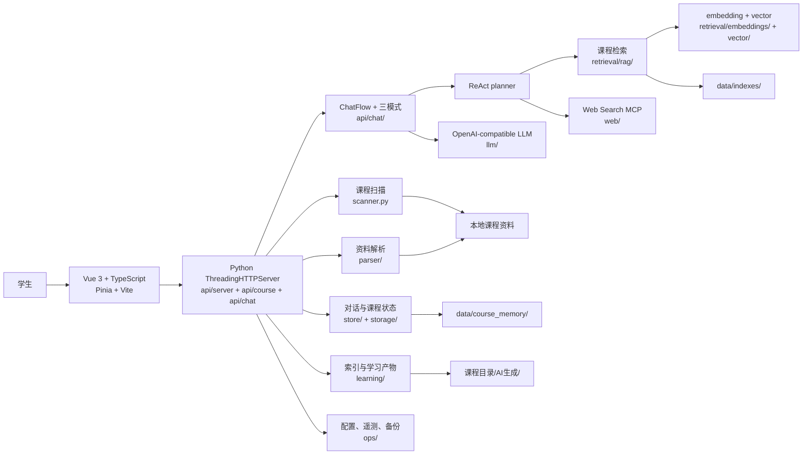
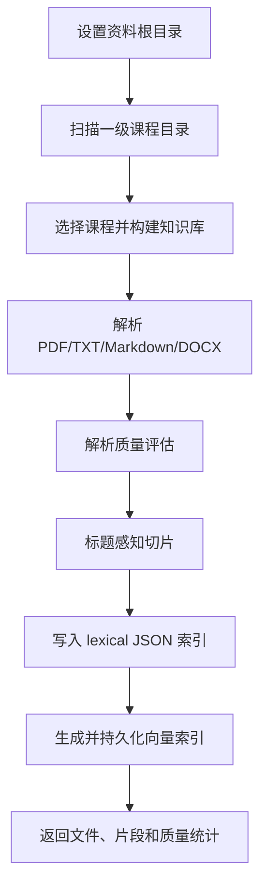
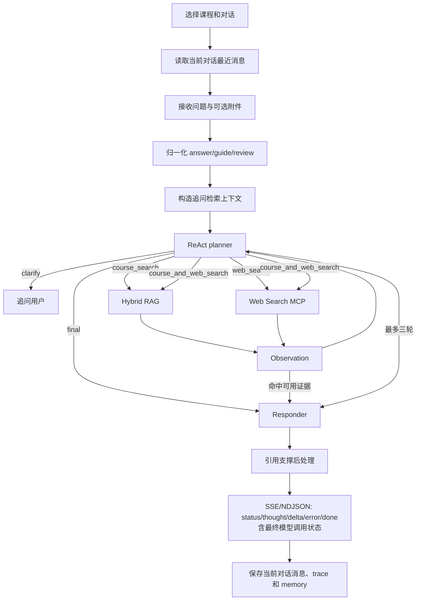
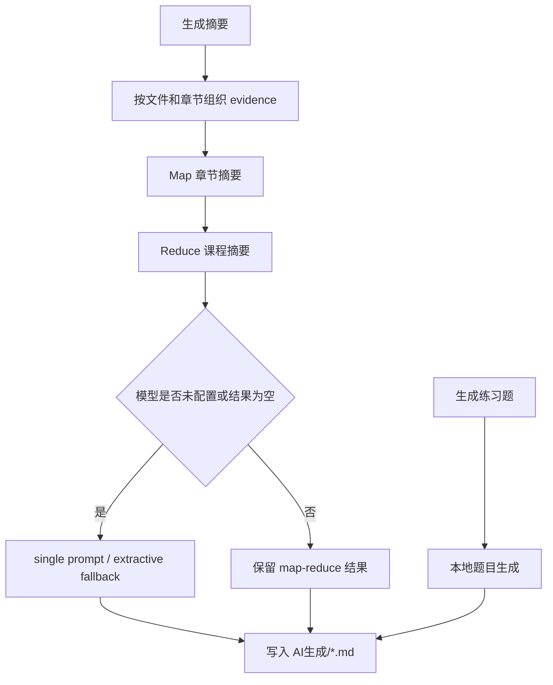
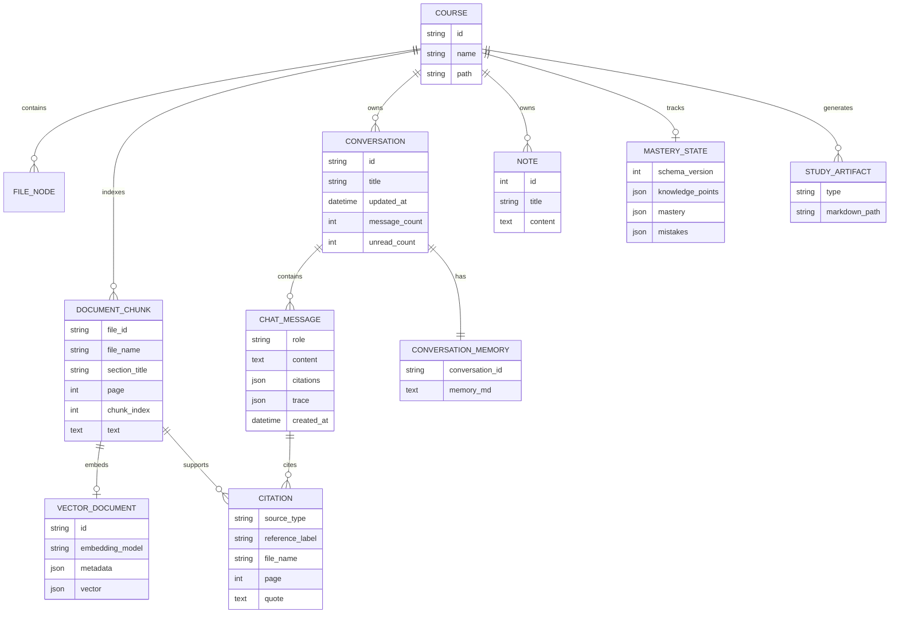

# 系统设计

本文描述当前 Vue 前端、Python API、文件型多对话存储、ReAct 聊天编排、hybrid RAG、学习产物、诊断与备份实现。

## 1. 总体架构



设计边界：

- 前端只通过 API 访问数据，不直接读取本地文件。
- 一级文件夹是一门课程；知识库、笔记和 mastery 按课程隔离。
- 一门课程可以包含多个对话；消息和压缩记忆按 `conversation_id` 隔离。
- ReAct planner 最多三轮决定 `final`、澄清、课程检索、联网或组合工具。
- 外部 LLM、embedding、rerank、Web Search 和 MinerU 均可选；本地 fallback 的能力与外部模型质量不同。
- 当前前端不展示 Dashboard 或 mastery 操作区；对应后端 API 仍保留。学习计划公开 UI/API 已移除。

## 2. 主要数据流

### 2.1 资料入库



图片可以预览并作为聊天视觉附件，但不会通过当前文本 parser 产生可检索 OCR 正文。

### 2.2 多对话聊天



同类工具已经执行后不会重复调用。计划中的课程或网页工具命中可用证据后直接进入最终 responder，避免二次 planner 判断。`final` 是 ReAct planner 的终止 action，表示无需工具并交给最终 responder，不是最终答案已经生成。带附件请求禁止联网。配置 LLM 后的瞬时错误最多共尝试五次；持续失败作为错误返回，已有 token 时不重放请求。

### 2.3 学习产物



`AI生成/` 可预览但不进入后续课程索引，避免模型产物成为自引用证据。

## 3. 数据模型



物理存储：

```text
data/
├─ config.json
├─ course_memory/<course_id>/
│  ├─ conversations.json
│  ├─ conversations/<conversation_id>/messages.json
│  ├─ conversations/<conversation_id>/memory.md
│  ├─ notes.json
│  └─ mastery.json
├─ chat_uploads/<course_id>/
├─ index_jobs.json
└─ indexes/
   ├─ <course_id>.json
   └─ <course_id>.vector.json
```

旧版课程级 `messages.json`/`memory.md` 在第一次读取对话时复制到 `conversations/default/`，旧文件保留用于回滚兼容。

## 4. HTTP API

### 4.1 系统和资料

| 方法 | 路径 | 功能 |
| --- | --- | --- |
| GET/POST | `/api/config` | 读取非密钥配置、设置资料根目录 |
| GET | `/api/config/status` | 完整 capability 状态 |
| GET | `/api/courses` | 扫描课程和文件树 |
| GET | `/api/files/preview?id=` | 返回可预览文件 |
| POST | `/api/courses/{course_id}/files` | 上传课程资料 |
| POST | `/api/courses/{course_id}/index` | 同步构建索引 |
| POST | `/api/courses/{course_id}/index/jobs` | 启动后台索引任务 |
| GET | `/api/index-jobs/{job_id}` | 查询任务状态 |

### 4.2 多对话

| 方法 | 路径 | 功能 |
| --- | --- | --- |
| GET/POST | `/api/courses/{course_id}/conversations` | 列出或新建对话 |
| POST | `/api/courses/{course_id}/conversations/{conversation_id}` | 重命名 |
| POST | `/api/courses/{course_id}/conversations/{conversation_id}/delete` | 删除 |
| POST | `/api/courses/{course_id}/conversations/{conversation_id}/read` | 标记已读 |
| GET | `.../{conversation_id}/messages` | 读取当前对话消息 |
| GET | `.../{conversation_id}/memory` | 读取当前对话记忆 |
| POST | `.../{conversation_id}/chat` | 当前对话流式问答 |
| POST | `.../{conversation_id}/summary` | 生成摘要并记录到当前对话 |
| POST | `.../{conversation_id}/quiz` | 生成练习题并记录到当前对话 |
| POST | `.../{conversation_id}/memory/clear` | 清空当前对话消息和记忆 |

未带 conversation 路径的 `messages`、`memory`、`chat`、`summary`、`quiz` 和 `memory/clear` 继续服务默认对话。

### 4.3 课程级学习数据

| 方法 | 路径 | 功能 | 当前前端 |
| --- | --- | --- | --- |
| GET/POST | `/api/courses/{course_id}/notes` | 读取或新增课程笔记 | 已使用 |
| POST | `/api/courses/{course_id}/notes/{note_id}` | 修改课程笔记 | 已使用 |
| POST | `/api/courses/{course_id}/notes/{note_id}/delete` | 删除课程笔记 | 已使用 |
| GET | `/api/courses/{course_id}/dashboard` | 聚合课程统计 | 未展示 |
| GET/POST | `/api/courses/{course_id}/mastery` | 掌握度状态 | 未展示 |
| POST | `/api/courses/{course_id}/mastery/mistakes/{id}/resolve` | 订正错题 | 未展示 |

没有公开 `/plan` 路由。

## 5. 模块职责

| 模块 | 主要路径 | 职责 |
| --- | --- | --- |
| 前端 | `frontend/src/components/`、`stores/`、`services/` | 三栏 UI、对话、预览、笔记和流式消费 |
| HTTP | `local_course_agent/api/server/`、`server.py` | Handler、路由和流响应 |
| 聊天 | `local_course_agent/api/chat/` | 模式策略、ReAct、附件、检索/联网 observation、生成 |
| 课程 API | `local_course_agent/api/course/` | 索引、上传、产物、dashboard、mastery |
| RAG | `local_course_agent/retrieval/rag/` | 索引读取、hybrid 检索、引用和本地回答 |
| 向量 | `retrieval/embeddings/`、`retrieval/vector/` | provider、持久化、搜索和融合 |
| 引用 | `retrieval/citations/` | 标签、支撑检查和生成后处理 |
| 学习 | `local_course_agent/learning/` | 索引任务、摘要、练习题、dashboard、mastery |
| 存储 | `local_course_agent/store/`、`storage/` | 多对话、消息、记忆、笔记、迁移和路径 |
| 外部服务 | `local_course_agent/llm/`、`web/`、`parser/` | LLM、MCP、MinerU/PDF/DOCX 适配 |
| 运维 | `local_course_agent/ops/` | capability、telemetry 和备份恢复 |

## 6. 安全和备份边界

- 服务默认监听 `127.0.0.1`，没有公网鉴权能力。
- 配置接口不返回密钥；真实 `config.json` 不提交。
- Markdown 预览使用 DOMPurify 清理 HTML。
- 上传、预览和恢复路径均在服务端做边界校验。
- 备份只包含 `config.example.json`、`course_memory/**` 和 `indexes/**`；真实配置与 `chat_uploads/` 明确排除。
- Web Search MCP 只接收搜索查询；LLM/embedding/rerank/MinerU 可能接收课程内容，详见 [`security-and-data-boundaries.md`](security-and-data-boundaries.md)。

## 7. 当前限制

- 文件型存储适合单机，不适合多用户并发服务。
- DOCX 仅基础正文抽取；扫描件和复杂布局依赖 OCR/MinerU。
- 本地 embedding 保证离线可运行，但不能替代真实语义模型质量。
- 外部 provider 持续失败会产生请求错误；界面提供进度和诊断，但不保证无损降级。
- Dashboard/mastery 只有后端/API 能力，学习计划只有遗留内部代码，不应描述成当前可见产品功能。
