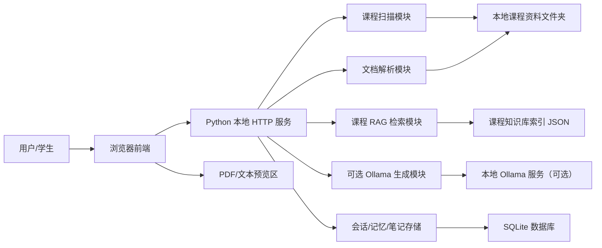
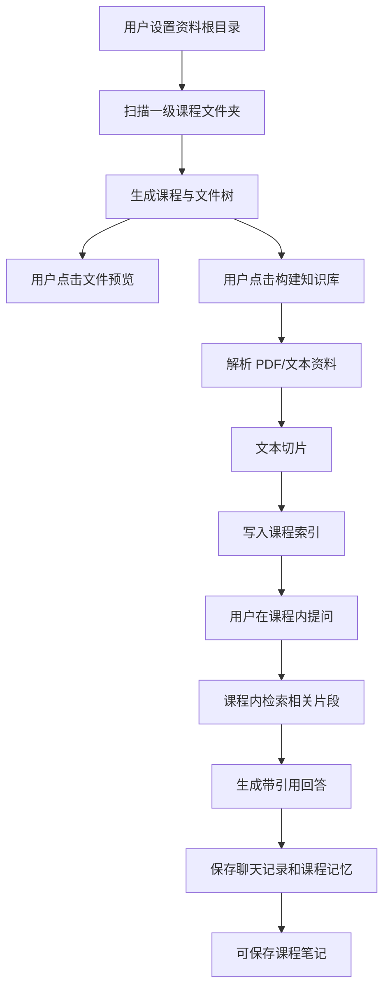
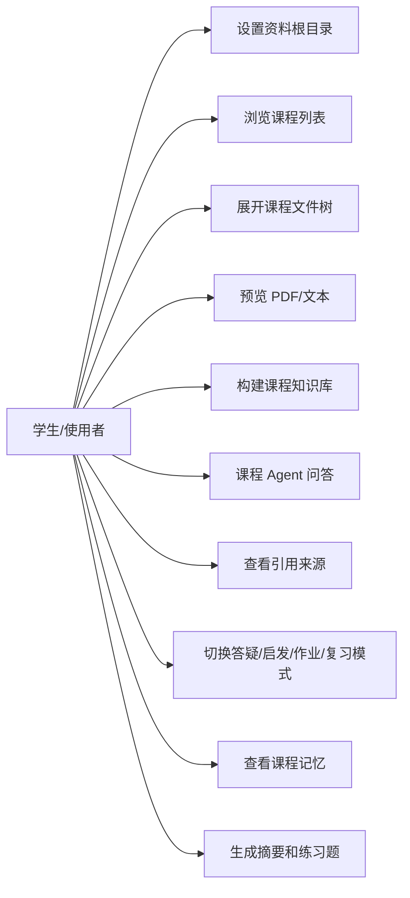
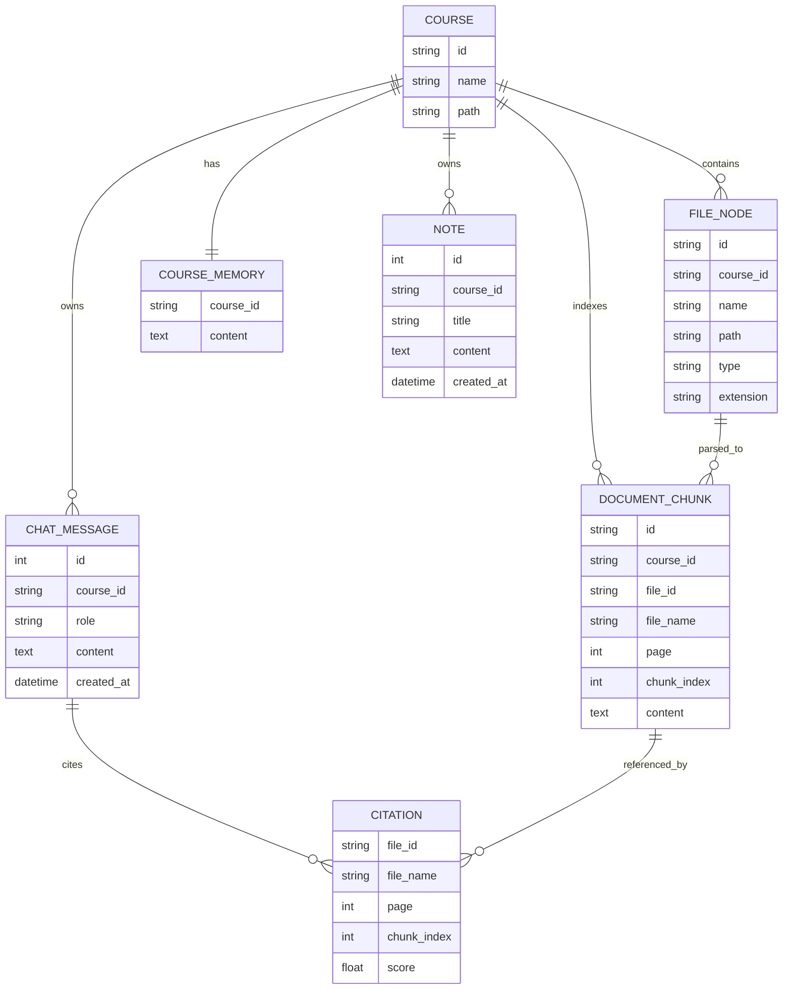
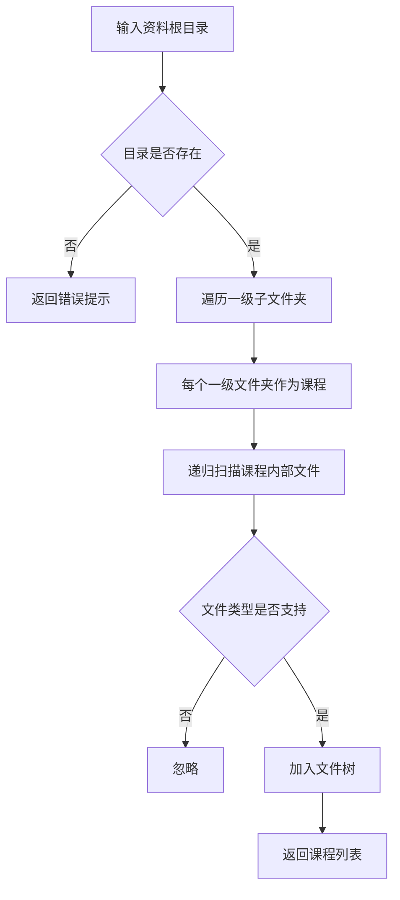
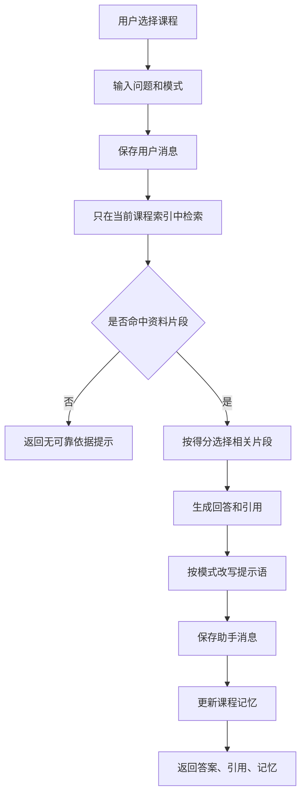

# 系统设计

本文给出系统结构、数据模型、接口和关键流程，既用于开发维护，也可作为课程设计报告“概要设计”和“详细设计”的基础材料。

## 1. 总体架构

设计说明：

- 浏览器前端负责交互展示，不直接读取本地文件。
- Python 本地服务负责所有文件扫描、预览、索引和问答接口。
- 每门课程单独索引，避免跨课程检索污染。
- SQLite 保存会话、课程记忆和笔记，便于重启后继续使用。
- Ollama 和 MinerU 是可选增强项，未配置时系统仍可运行。

## 2. 数据流图

## 3. 用例图

## 4. E-R 图

当前代码中 `COURSE` 和 `FILE_NODE` 由本地目录实时扫描生成；`DOCUMENT_CHUNK` 存储在 `data/indexes/`；`CHAT_MESSAGE`、`COURSE_MEMORY`、`NOTE` 存储在 SQLite。

## 5. 课程扫描流程

## 6. 课程 Agent 问答流程

## 7. 接口设计

| 方法 | 路径 | 功能 |
| --- | --- | --- |
| GET | `/api/config` | 读取资料根目录配置 |
| POST | `/api/config` | 设置资料根目录 |
| GET | `/api/courses` | 扫描并返回课程列表和文件树 |
| GET | `/api/files/preview?id=` | 预览 PDF、MD、TXT 文件 |
| POST | `/api/courses/{course_id}/index` | 构建指定课程知识库 |
| GET | `/api/courses/{course_id}/messages` | 获取课程聊天记录 |
| POST | `/api/courses/{course_id}/chat` | 在指定课程内问答 |
| GET | `/api/courses/{course_id}/memory` | 获取课程记忆 |
| GET | `/api/courses/{course_id}/summary` | 生成课程摘要 |
| GET | `/api/courses/{course_id}/quiz` | 生成课程练习题 |
| GET | `/api/courses/{course_id}/notes` | 获取课程笔记 |
| POST | `/api/courses/{course_id}/notes` | 保存课程笔记 |

## 8. 当前实现与后续增强

当前实现：

- 文件扫描和课程识别已完成。
- PDF/文本预览已完成。
- 轻量课程索引和关键词检索已完成。
- 独立课程会话和课程记忆已完成。
- 可选 Ollama 生成接入点已完成。
- MinerU Agent 轻量解析 API 接入已完成，并保留本地命令兼容降级。
- 课程笔记保存已完成。
- 课程摘要和练习题生成已完成。

后续增强：

- 用 MinerU 替换或增强 PDF 文本解析。
- 用 ChromaDB + embedding 实现语义向量检索。
- 加入 BM25 + rerank 的混合检索。
- 接入 Ollama 或云 API，让回答更自然。
- 前端升级为 Vue3，增加笔记、错题和统计看板。
